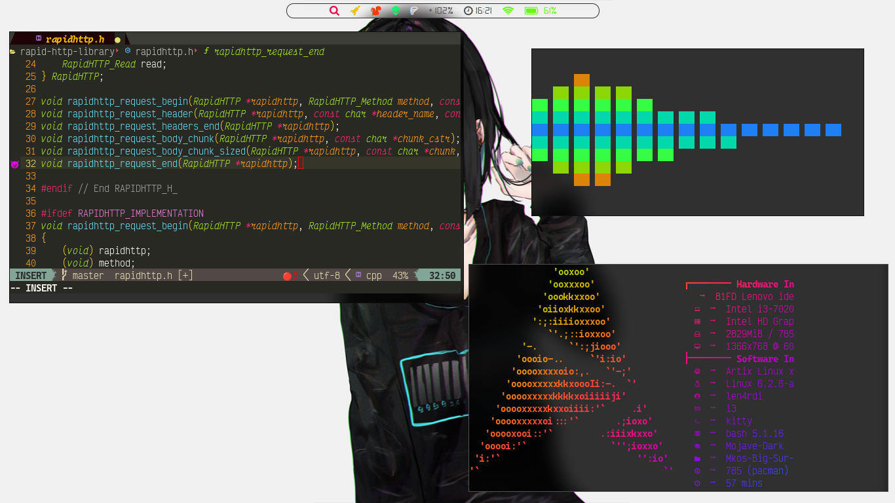
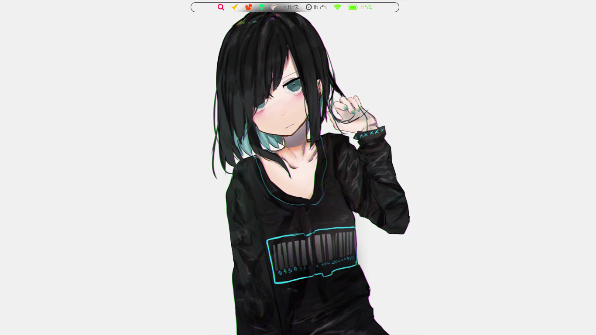

## Minimal configuration for Tiling Window Manager ❤️




## What is Tiling Window Manger (TWM) ? 🤔
A tiling window manager is a type of window manager used in graphical user interfaces (GUIs) where windows<br>
are tiled to fit onto the screen without any overlapping. Instead of allowing users to freely move and resize<br>
windows, a tiling window manager automatically arranges them in a non-overlapping grid-like pattern, maximizing<br>
the use of screen real estate.<br>
<br>
Tiling window managers are often used by power users and developers who value efficiency and productivity, as<br>
they provide a fast and streamlined way to manage windows and applications. Some popular examples of tiling<br>
window managers include i3, Awesome, and Xmonad.<br>


## Advantages and Disadvantages ✏️
🟢 Higher productivity<br>
🟢 Extremely fast and lightweight<br>
🟢 Very beautiful<br>
🔴 Large learning curve<br>
🔴 Increased keyboard usage


## Getting Started 🚀
Starting with i3wm version 4.22, `i3gaps is no longer required`⚠️

### Prerequisites
✅&ensp;Picom(jonaburg)<br>
✅&ensp;ibhagwan/picom<br>
✅&ensp;i3wm (only)

### Fonts:
Digital 7<br>
Iosevka Nerd Font<br>
FontAwesome5Brands<br>

## Polybar installation on debian based systems 🛠

Update your system
```sh
sudo apt updade && sudo apt upgrade
```
Install polybar
```sh
sudo apt install polybar
```
```sh
cp $HOME/Downloads/dotfiles/setup/polybar/config.ini ~/.config/polybar/
```
For a complete installation and customization reference go to: <a href="https://github.com/polybar/polybar">Polybar</a>

## Polybar on Void Linux 🛠
Update your system
```sh
sudo xbps-install -Suvy
```
Getting polybar
```sh
sudo xbps-install -Svy polybar
```
```sh
cp $HOME/Downloads/dotfiles/setup/polybar/config.ini ~/.config/polybar/
```

## Polybar on Arch/Artix Linux 🛠
Update your system
```sh
sudo pacman -Syyu
```
Getting polybar
```sh
sudo pacman -S polybar
```
```sh
cp $HOME/Downloads/dotfiles/setup/polybar/config.ini ~/.config/polybar/
```
## How to add modules on your polybar ⚙️
#### Example default module in config file
```ini
[module/date]
type = internal/date
interval = 1
date = %H:%M
label =   %date%
label-foreground = #B9B9B9
```
#### Example custom module in config file
```ini
[module/example]
type = custom/script
exec = echo "Its a example"
click-left = "firefox https://github.com/len4rdi" &

format = <label>
format-prefix = "Github"
format-prefix-foreground = #101010
format-prefix-background = #000000
```

## Contributors

