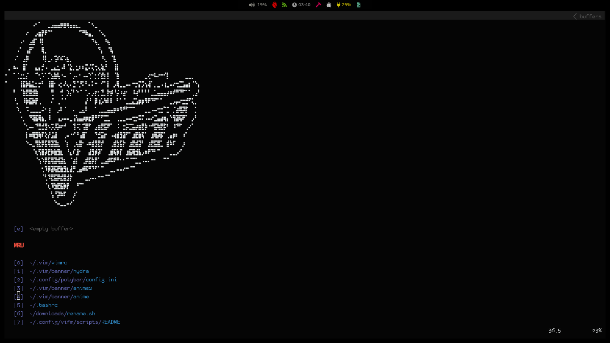

<div id="top"></div>

<!-- ABOUT THE PROJECT -->
### About The Project




<p align="right">(<a href="#top">back to top</a>)</p>

<!-- GETTING STARTED -->
<div id="getting-started">

### Getting Started

<h5> Installing and customizing vim</h5>
Overview:<br>
Vim 8 added a native way to load third-party packages. This means, for me at least, there is no longer any need to use a third party
plugin helper like Pathogen.<br><br>
The approach is very similar to the Pathogen package it adds paths to the Vim runtime path where packages can be added. This is sensible as there are
very few changes required to switch from Pathogen to using the native functionality.

How it works
If you store your vim configuration in ~/.vim a new folder needs to be created within this folder to hold plugins. This is somewhat
confusingly ~/.vim/pack/packages. The folder packages can be anything. You can keep it at packages, change it to my-plugins or your whatever you like.
I chose to use my internet handle.

```sh
mkdir -p ~/.vim/pack/packages/start
```
And
```sh
mkdir -p ~/.vim/pack/packages/opt
```

Within this folder a further folder `start` the im will pick up any packages added to this folder and automatically load the plugins.
Optionally another folder `opt` may be created to hold packages that are not loaded automatically. Packages added in the opt folder may be loaded using:
```sh
:packadd packagename
```

Installing a module for any example:
```sh
cd ~/.vim/pack/packages/start
```
```sh
start$ git clone Your favorite plugins
```

The plugins I use:
* <a href="https://github.com/preservim/nerdtree">NerdTree</a>
* <a href="https://github.com/Yggdroot/indentLine">Indent Line</a>
* <a href="https://github.com/vim-airline/vim-airline">Vim AirLine</a>
* <a href="https://github.com/mhinz/vim-startify">Vim startfy</a>
* <a href="https://github.com/tribela/vim-transparent">Vim transparent</a>
* <a href="https://github.com/ryanoasis/vim-devicons">Vim Icons</a>
* <a href="https://github.com/jiangmiao/auto-pairs">Vim auto-pairs</a>
* <a href="https://github.com/kien/ctrlp.vim">Control P</a>


### Installing the shell I use
Overview CSH/TCSH:<br>
It is essentially the C shell with programmable command-line completion, command-line editing, and a few other features. Unlike the other common shells,
functions cannot be defined in a tcsh script and the user must use aliases instead (as in csh). It is the native root shell for BSD-based systems such as 
FreeBSD.

Getting the tcsh on Debian/Ubuntu/Mint Linux
```sh
sudo apt-get install csh
```

<p align="right">(<a href="#top">back to top</a>)</p>
